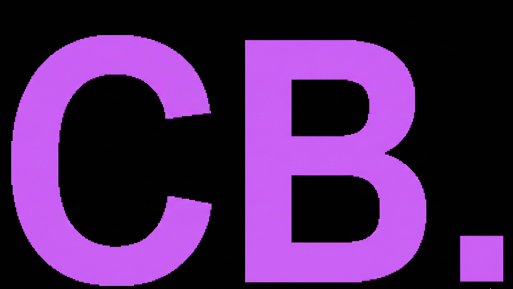

# Crisneil Bucio Sanchez - Personal Portfolio

<h2 align="center">
  
  <br>
  Crisneil's Portfolio
</h2>

<p align="center">
  <strong>Software Development | UI/UX Design | IT Infrastructure</strong>
</p>

---

## 🚀 About Me

I am a detail-oriented Software Development and UI/UX student with hands-on experience in IT infrastructure and full-stack web development. This portfolio showcases my projects, skills, and journey as a developer.

### Key Projects
- **PawCare Capstone**: A comprehensive pet management system for the Municipal Veterinary Office of Meycauayan.
- **Maykawayan Game**: An immersive experience based on Filipino folklore and mythology.
- **Internship at Sterling Global**: Extensive experience in Linux server installation and technical support.

---

## 🛠️ Technical Skills

- **Programming**: Laravel, JavaScript, PHP, HTML5, CSS3
- **Design**: UI/UX Research, Wireframing, User Interface Design
- **Infrastructure**: Linux Administration, Hardware Troubleshooting, System Maintenance

---

## 🌐 Find Me Online

- **LinkedIn**: [Crisneil Bucio Sanchez](https://www.linkedin.com/in/crisneil-bucio-gh0st/)
- **GitHub**: [@Crizneil](https://github.com/Crizneil)

---

## 📦 Getting Started

1. Clone the repository:
   ```bash
   git clone https://github.com/Crizneil/Crisneil-Portfolio-Official.git
   ```
2. Install dependencies:
   ```bash
   npm install
   ```
3. Run the development server:
   ```bash
   npm start
   ```

---

<p align="center">
  Built with ❤️ by Crisneil Bucio Sanchez
</p>
